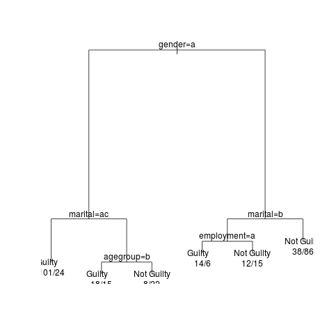

**Parts 1, 2, and 3:** All code for the functions should be in *Assignment4.R*. I have included another function called split, which will take a dataframe and a column name, and return a list of dataframes after splitting on that column name.

**Part 4:** Using the above functions, I went through the data frame using max.gain() to find which column to split on next. for each split, I save the new data frames to their own variables. The naming scheme shows which variable was split on and which value it has. I do this until I have 24 dataframes (24 being the amount of possible combinations of variables). I created the rules for all these possibilities, using the majority.vote() function (which returns the value of the dependent variable that occurs the most as well as the % of the clashset covered by this value).

The rules I came up with give about a 68% accuracy. This has an upper limit since some of the rows in the training data are explicitly contradictory, so some miscategorization must happen. I use the same code to write the predictions for the private data set, which is saved to *jury.private.predictions.csv*.

**Part 5:** The code for creating a decision tree from **C50** and **rpart** are at the end of *Assignment4.R*. The model from rpart is plotted to show a visual representation of the tree that was found, which is saved to *tree.png*, and shown here:

