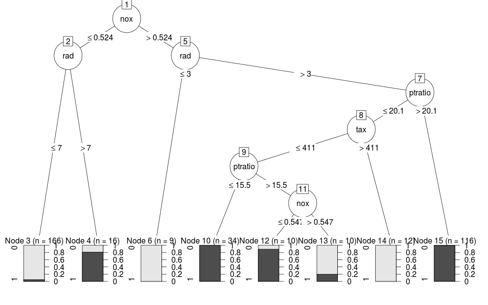
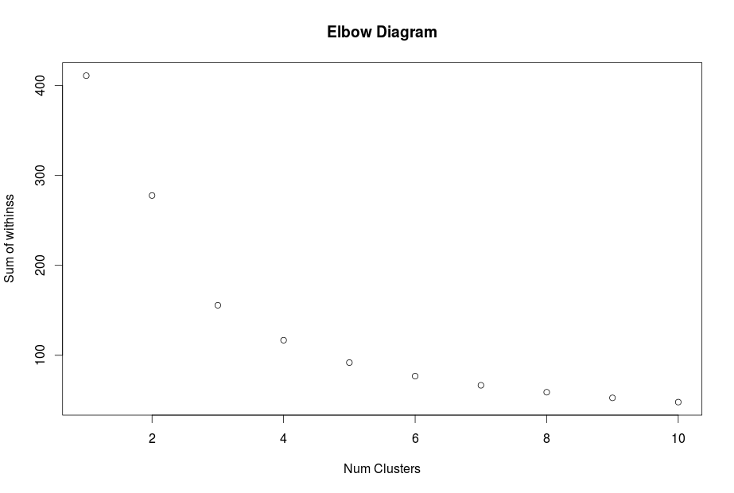
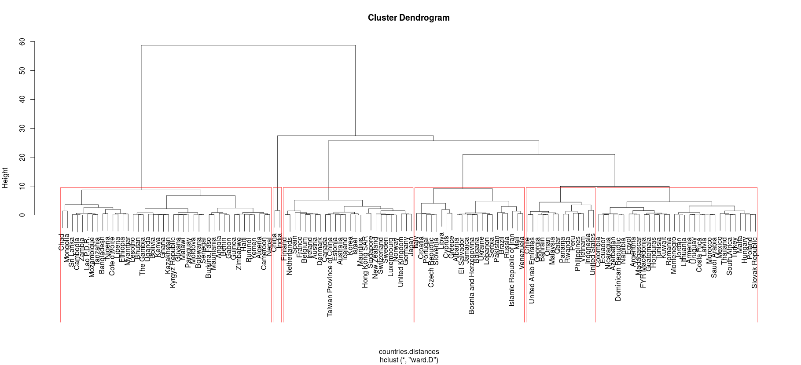

For this final, I collaborated with:

* Sharad Garung
* Aaron Palumbo
* Brain Chu

For all questions, please refer to [my github repo](https://github.com/jquacinella/IS621_Assignments/tree/master/Final) for all code in this assignment.

## Question 1 - Part 1: Classification

To classify the data into two groups (whether or not the row rperesents a neighborhood that is expected to have a high risk for criminal activity), two tree models were trained using different R implementations, rpart and C50. After training a model using all the columns of the training data, with an 80 - 20 split between trainging and test daya, both models had >95% accuracy on the training data. The confusion matrix for the C50 model, which is the model I'm choosing due to its slightly higher accuracy on the training data, has the following confusion matrix:

          Reference
Prediction  0  1
         0 43  1
         1  2 47

Only 3 test cases were misclassified from the test data set. The most important columns in predicting the data according to this model are nox, rad and ptratio. See below for the final output of the C50 model:

The final predictions from this model have been appeneded as columns to the evaluation data set in the file **crime-evaluation-data-with-prediciton.csv**.

## Question 1 - Part 2: Regression

For this part, I created 7 inear regression models, based on various combinations of the predictors. After looking at R^2, the mean of error squared and the plot of residuals, the best model is indeed to use all threee predictor variables. For this model, we get around 30% of the variance explained with a mean error squared of 719, which was the best out of the given models. This is not that great of a model, with a lot of variance still left unexplained with a decent amount of error. The conclusion I would draw from this is either the underlying relationship is non-linear, or that there are more hidden variables that we do not have access to.

The final predicitons for the evaluation data are stored in **cigarette-evaluation-data-with-prediction.csv**.

## Question 2 - Clustering

In this part, we use the countries data and group the data using both kmeans and heirarchical clustering. With kmeans clustering, we need to tell it ahead of time how many clusters we expect. For this, various kmeans models were developed for k = 1 to 10 clusters, using the tot.withinss model attribute to determine which k value is best. The tot.withinss model attribute is the sum of of the within-cluster square distances, and we use this as a metric as we want the distances within clusters to generally be smaller. Using this, here is the elbow graph below:

Given this and the instructions, I choose k = 6 as optimal. Using this model, I exported the cluster assignments to **countries-mapping.csv**.

I also produced a dendrogram via heirarchical clustering, but the output below is hard to read. I highlighted 6 groups on the dendrogram, but seeing as it is hard to read, the final model chosen is the k-means cluster with k=6.

